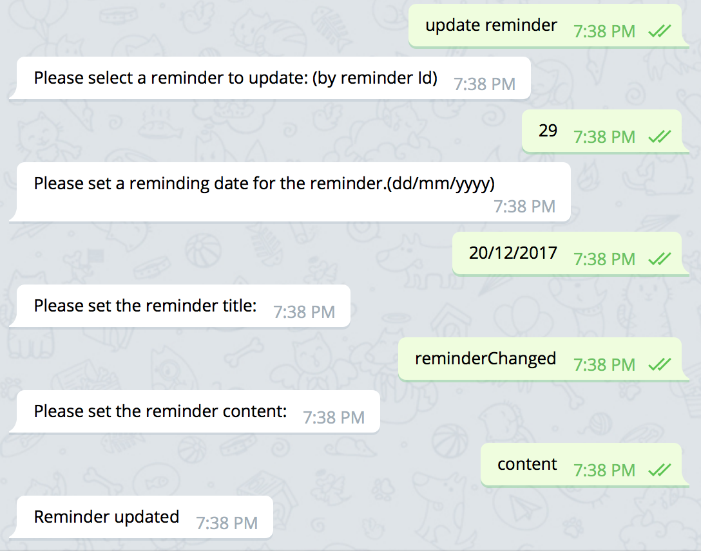
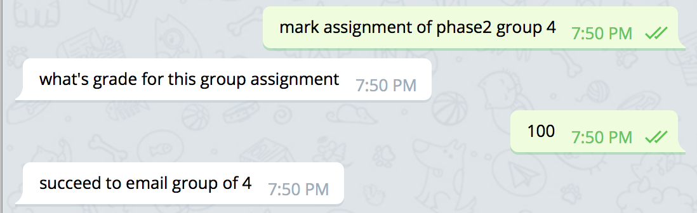

# Course Management Bot in Telegram

UNSW COMP9323 e-Enterprise Project 17S2

### Deploy Instruction:
1. Run *ngrok* (Secure tunnels to localhost) 
	1. Download correct version of grok via [ngrok - download](https://ngrok.com/download)
	2. Install ngrok and run http on port 8080: `<ABSOLUTE_PATH_TO_NGROK>/ngrok http 8080`
2. Copy the URL after *Forwarding* (i.e. : http://77b2f954.ngrok.io in the below example)
  
3. Login into Api.ai (now called Dialogflow):
	1. Click this link to login: [Dialogflow](https://console.dialogflow.com/api-client/#/login)
	2. Sign in with Google with username: `comp9323bot@gmail.com` and password `comp9323`
	3. Click **Allow** and **Access** to api.ai access google account info
	4. Now you’ve logged into api.ai
4. Configure localhost address with Api.ai:
	1. On the left hand column of Api.ai (now called Dialogflow), click on **Fulfillment**
	2. In the *URL* text box, enter `<ngrok_URL>/rest/webhook`, where` <ngrek_URL> `is the URL you obtained from Step 2. i.e.  according to Step 2, my URL will be `http://77b2f954.ngrok.io/rest/webhook`
5. Configure Database on Google Cloud
	1. Login into Google Cloud via [Google Cloud Platform](https://console.cloud.google.com/) with the account information in Step 3

	2. Check the top left corner that you are under project **cmbot**: 

	3. At the left column, click on the section **SQL** under Home -> Storage -> SQL

	4. Click on the Instance called **sql4cmbot**:

	5. Click on AUTHORIZATION:

	6. Scroll down and click on **Add network**:

	7. Give yourself a random name and input your current IP Address (just google *IP*): 

     
	8. Click **Done** and the blue **Save** bottom, then wait a moment
6. Download and open Eclipse, import our project.
	1. Import the zip file via: **Import**  -> **General** -> **Existing project into Workspace**:
7. Configure Constant data:
	1. Clicking on: **Java Resources** ->  **src/main/java** -> **edu.unsw.comp9323.bot.constant**
	2. Open **Constant.java** under above package
	3. On the 9th line, for the variable `DOMAIN_NAME`, let it equals the URL you obtained from *Step 2* 
8. Right click on the project root file, do **Maven** -> **Update Project** 
9. Run the project:
	1. Clicking on: **Java Resources**-> **src/main/java** -> **edu.unsw.comp9323.bot**
	2. On the file called *SpringBootExampleApplication.java* in the above package, right click the file and **Run As** -> **Java Application**
10. Start the application on Telegram
	1. Download Telegram (on phone or desktop)
	2. Send yourself a message: `@coursemanager_bot`
	3. click on the message *@coursemanager_bot*. It will open a bot message window. Click on **Start** and you can start the conversation.

### Sample command:
1. Login (mentor/ student)
2. Interrupt and start new conversation (mentor/ student)
3. Send email functionalities (email certain people including individual, groups or whole class):   
	* Interactively: (mentor/ student)
	* With template:  (mentor/ student)
4. Reminder functionalities (reminder will be sent via email automatically)
	* Set new reminder (mentor/ student)
	* Get reminder list (mentor/ student)
	* Reminder details (mentor/ student) 
	* Update a reminder (mentor/ student)
	* Delete a reminder (mentor/ student)
5. Assignment functionalities
	* Add assignment by title (mentor)
	* Update assignment by title with due date (mentor)
	* Get assignment of phase5 (mentor/ student)
	* Get assignment submission of group number (mentor)
	* Mark assignment by title group number (mentor)
	* Submit assignment (student)
	* Get assignment mark of assignment title (student)
6. Resources functionalities
	* Add class resource (mentor)
	* Update class resource (mentor)
	* Delete class resource (mentor)
	* Get class resource (mentor)

### Author:
- Lei Zhao,  [Email](zlinaus@gmail.com),  [Github](https://github.com/Char1ei)  
- Yijun Fang,  [Email](fangyijun1212@gmail.com),  [Github](https://github.com/YijunFang)  
- Minhui Su,  [Email](aaronlife.au@gmail.com),  [Github](https://github.com/AaronSuAu)  
- Yuanjie Yang,  [Email](yangyjrex@gmail.com),  [Github](https://github.com/yangyjRex)  

